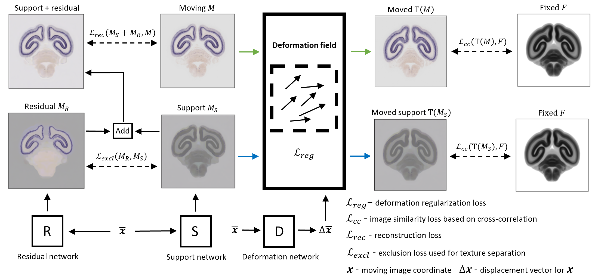

## Implicit neural representations for joint decomposition and registration of gene expression images in the marmoset brain

# Abstract

We propose a novel image registration method based on implicit neural representations that addresses the challenging problem of registering a pair of brain images with similar anatomical structures, but where one image contains additional features or artifacts that are not present in the other image. To demonstrate its effectiveness, we use 2D microscopy in situ hybridization (ISH) gene expression images of the marmoset brain. Accurately quantifying gene expression requires image registration to a brain template, which is difficult due to the diversity of patterns causing variations in visible anatomical brain structures. Our approach uses implicit networks in combination with an image exclusion loss to jointly perform the registration and decompose the image into a support and residual image. The support image aligns well with the template, while the residual image captures individual image characteristics that diverge from the template. In experiments, our method provided excellent results and outperformed other registration techniques. 

# About

This repository presents some examples assosiated with our study about the implicit networks based joint image registration and decomposition. If you find this site useful for your work, consider citing our paper ([bibtex](figures/miccai_cit.txt)): 

[Byra, M., Poon, C., Shimogori T., Skibbe H., Implicit neural representations for joint decomposition and registration of gene expression images in the marmoset brain, MICCAI 2023.](https://doi.org/10.1007/978-3-031-43999-5_61)

# Contents

- example_nissl: registration of an ISH image to a nissl image (+ decomposition)

# TODOS:

- more examples
- more comments

